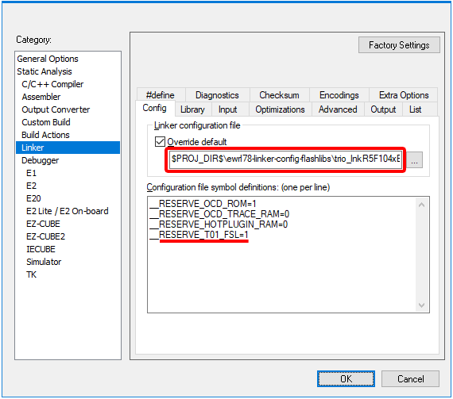

## Project Setup Example for T01-FSL  
You can refer to the previous setup steps [here](README.md#how-to-use-the-icf-trio).

- Install the [RL78 T01-FSL Library](https://www2.renesas.eu/products/micro/download/?oc=SelfLib_RL78) you have [previously downloaded](README.md#pre-requisites). During the installation, select to install for the __IAR Compiler v2.10__ (or later) on the project folder (`$PROJ_DIR$`). The installer will create a folder named `FSL\IAR_210` (or similar).

### Linker configuration
- In the IDE, go to the __Project__ → __Options__ → __Linker__ → __Config__ → __Linker configuration file__.

- Tick __Override default__ and select the corresponding __trio_lnk\<device\>.icf__ for the target device in use. In this example, we are using the R5F104LEA target, so the [trio_lnkR5F104xE.icf](trio_lnkR5F104xE.icf) will be selected: `$PROJ_DIR$\ewrl78-linker-config-flashlibs\trio_lnkR5F104xE.icf`

- In the same configuration tab, append `__RESERVE_T01_FSL=1` to the __Configuration file symbol definition__, as below: 



- In __Linker__ → __Library__ → __Additional libraries__, add the following line:
```
$PROJ_DIR$\FSL\IAR_210\lib\fsl.a
```

- In __C/C++ Compiler__ → __Preprocessor__ → __Additional include directories__, add the following 2 lines:
```
$PROJ_DIR$\applilet3_src
$PROJ_DIR$\FSL\IAR_210\lib
```

> __Note__ Each target device has its own memory reservation requirements. In order to get the best out of the trio configurations, please choose the appropriate `trio_lnk<device>.icf` linker configuration for the actual device you are using in your project, directly from the repository you cloned inside the project's directory (`$PROJ_DIR$\ewrl78-linker-config-flashlibs`).

### Example source code
Now it is time to update the application with this example source code below that exercises some of the library's capabilities.

- Open the `Renesas_AP\cg_src\r_main.c` and insert the FSL headers between the generated comment guards for the "user code for include", as below:
```c
...
/* Start user code for include. Do not edit comment generated here */
/* FSL headers */
#include "fsl.h"
#include "fsl_types.h"
/* End user code. Do not edit comment generated here */
#include "r_cg_userdefine.h"
...
```

- In the _Global variables and functions_ section_, add the `WriteStringFAR[]`, `WriteStringNEAR[]` and `ReadString[]` between the comment guards, as below:
```c
/********************************...**
Global variables and functions
*********************************...**/
/* Start user code for global. Do not edit comment generated here */

#define FSL_BLOCK_SIZE   (0x0400U)

/* Set the FSL BLOCK (1KB) address within the mirror-able region */
#define FSL_BLOCK_ADDR   (0x010000U - 8U*FSL_BLOCK_SIZE)
#define FSL_BLOCK_SLOT   (FSL_BLOCK_ADDR/FSL_BLOCK_SIZE)

/* The FSL BLOCK will be mirrored on the Near Area */ 
#define FSL_BLOCK_ADDR_MIRRORED  (FSL_BLOCK_ADDR | 0xF0000U)

#define STRING_SZ 16
fsl_u08 WriteString[STRING_SZ] = "0123456789ABCDEF";

/* Access the data directly from the Code Flash (24-bit __far address) */
#pragma location = FSL_BLOCK_ADDR
__root __far const fsl_u08 ReadStringFAR[STRING_SZ];

/* Access the data from the Mirror Area (16-bit __near address - more efficient access!) */
#pragma location = FSL_BLOCK_ADDR_MIRRORED
__root __near __no_init fsl_u08 ReadStringNEAR[STRING_SZ];

/* End user code. Do not edit comment generated here */
```

- Replace the original `main()` function with the following code snippet:
```c
void main(void)
{
    R_MAIN_UserInit();
    /* Start user code. Do not edit comment generated here */
    
    /* FSL local vars */
    fsl_descriptor_t FSL_descriptor;
    fsl_write_t      FSL_wr;
    fsl_u08          FSL_status;

    /* Initiate the FSL library */
    FSL_descriptor.fsl_flash_voltage_u08 = 0x00;
    FSL_descriptor.fsl_frequency_u08 = 32;
    FSL_descriptor.fsl_auto_status_check_u08 = 0x01;
    FSL_status = FSL_Init((__far fsl_descriptor_t*)&FSL_descriptor);
    if (FSL_OK != FSL_status)
    {
        while(1);
    }
    FSL_Open();
    FSL_PrepareFunctions();

    /* Erases the FSL_BLOCK_SLOT contents */
    FSL_status = FSL_Erase(FSL_BLOCK_SLOT);
    while (FSL_BUSY == FSL_status)
    {
        FSL_status = FSL_StatusCheck();
    }

    /* Writes "WriteString" to the FSL_BLOCK_ADDR */
    FSL_wr.fsl_data_buffer_p_u08 =  WriteString;
    FSL_wr.fsl_word_count_u08 = STRING_SZ/4; // 32-bit aligned writes
    FSL_wr.fsl_destination_address_u32 = FSL_BLOCK_ADDR;
    FSL_status = FSL_Write(&FSL_wr);
    while (FSL_BUSY == FSL_status)
    {
        FSL_status = FSL_StatusCheck();
    }

    /* Closes the FSL */
    FSL_Close();

    /* The infinite loop */
    for (;;)
    {
    }
    /* End user code. Do not edit comment generated here */
}

```
## Configuring and debugging the project
- Go to the Project Options, __General Options__ → __Target__ → __Device__ and choose the desired part number.

- In the project options, __Debugger__ → __Setup__ → __Driver__ and choose the emulator you have. Typically _TK_, _E1_ or _E2 Lite_ depending on the emulator in use.

- Start a new C-SPY debugging session by choosing __Project__ → __Download and Debug__. If necessary, choose the right _Power supply_ voltage for the _Target system_ in the _Emulator Hardware Setup window_. In this case, as the __LVD__ was set to `3.63V`, the choosen voltage was `5V`.

- Tick the __Erase flash before next ID check__ checkbox.

- Click _OK_ to close the _Hardware Setup window_.

- By default, C-SPY will execute the application until it reaches a breakpoint in the beginning of the `main()` function. Insert a breakpoint near the `FSL_Close()` call in the end of the `main()` function.

- Activate the _Watch window_ by selecting __View__ → __Watch__ → __Watch1__. This window will allow you to add expressions to watch the contents of global variables.

- __\<Click to add\>__ `ReadStringNEAR`, `ReadStringFAR` and `WriteString`.

- Hit __Go__ (<kbd>F5</kbd>) on the _Debug toolbar_.

- In the _Watch1 window_, verify if the contents of the variables `ReadString` and `WriteString` match.

> __Note__ The data written into the __Code Flash__ can also be directly seen by activating the __Memory Window__. In this case, select __View__ → __Memory__ → __Memory1__ and _Go to_ the address `&ReadStringFAR`.
>
>  
>
> The same data will be also available from the Near Memory __(`0xF0000`-`0xFFFFF`)__, which provides a computationally cheaper way of accessing the same data. This area is addressable by 16-bit pointers. Activate a new _Memory window_ by selecting __View__ → __Memory__ → __Memory2__ and _Go to_ the address `&ReadStringNEAR` to visit the __Mirrored Data__.
>
>  

[< ICF Trio documentation page](README.md#examples)
