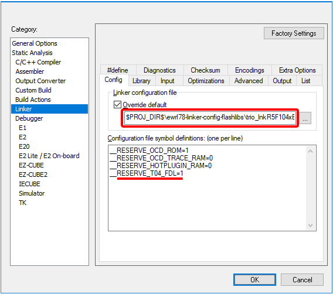

## Project Setup Example for T04-FDL (pico FDL)
You can refer to the previous setup steps [here](README.md#how-to-use-the-icf-trio).

- Install the [RL78 T04-FDL Library](https://www2.renesas.eu/products/micro/download/?oc=EEPROM_EMULATION_RL78) you have [previously downloaded](README.md#pre-requisites). During the installation, select to install for the __IAR Compiler v2.10__ (or later) on the project folder (`$PROJ_DIR$`). The installer will create a folder named `FDL\IAR_210` (or similar).

### Linker configuration
- In the IDE, go to the __Project__ → __Options__ → __Linker__ → __Config__ → __Linker configuration file__.

- Tick __Override default__ and select the corresponding __trio_lnk\<device\>.icf__ for the target device in use. In this example, we are using the R5F104LEA target, so the [trio_lnkR5F104xE.icf](trio_lnkR5F104xE.icf) will be selected: `$PROJ_DIR$\ewrl78-linker-config-flashlibs\trio_lnkR5F104xE.icf`

- In the same configuration tab, append `__RESERVE_T04_FDL=1` to the __Configuration file symbol definition__, as below: 



- In __Linker__ → __Library__ → __Additional libraries__, add the following line:
```
$PROJ_DIR$\FDL\IAR_210\lib\pfdl.a
```

- In __C/C++ Compiler__ → __Preprocessor__ → __Additional include directories__, add the following 2 lines:
```
$PROJ_DIR$\applilet3_src
$PROJ_DIR$\FDL\IAR_210\lib
```

> __Note__ Each target device has its own memory reservation requirements. In order to get the best out of the trio configurations, please choose the appropriate `trio_lnk<device>.icf` linker configuration for the actual device you are using in your project, directly from the repository you cloned inside the project's directory (`$PROJ_DIR$\ewrl78-linker-config-flashlibs`).

### Example source code
Now it is time to update the application with this example source code below that exercises some of the library's capabilities.

- Open the `Renesas_AP\cg_src\r_main.c` and insert the __pico FDL__ headers between the generated comment guards for the "user code for include", as below:
```c
...
/* Start user code for include. Do not edit comment generated here */
/* Pico FDL headers */
#include "pfdl.h"
#include "pfdl_types.h"
/* End user code. Do not edit comment generated here */
#include "r_cg_userdefine.h"
...
```

- In the _Global variables and functions_ section add the `WriteString[]` and `ReadString[]` global arrays between the comment guards, as below:
```c
/********************************...**
Global variables and functions
*********************************...**/
/* Start user code for global. Do not edit comment generated here */
#define STRING_SZ 16
pfdl_u08 WriteString[STRING_SZ] = "0123456789ABCDEF";
pfdl_u08 ReadString[STRING_SZ];
/* End user code. Do not edit comment generated here */
```

- Replace the original `main()` function with the following code snippet:
```c
void main(void)
{
    R_MAIN_UserInit();
    /* Start user code. Do not edit comment generated here */
    /* pico FDL local vars */
    pfdl_descriptor_t PFDL_descriptor;
    pfdl_request_t    PFDL_request;
    pfdl_status_t     PFDL_status;

    /* Open the pico FDL */
    PFDL_descriptor.fx_MHz_u08 = 32;
    PFDL_descriptor.wide_voltage_mode_u08 = 0;
    PFDL_Open (&PFDL_descriptor);
 
    /* Check if the Data Flash region is blank */
    PFDL_request.index_u16 = 0x0000; // Rel. 16-bit addr @ 0xF1000
    PFDL_request.command_enu = PFDL_CMD_BLANKCHECK_BYTES;
    PFDL_request.bytecount_u16 = STRING_SZ;
    PFDL_status = PFDL_Execute(&PFDL_request);
    while (PFDL_BUSY == PFDL_status)
    {
        PFDL_status = PFDL_Handler();
    }
    
    /* If not empty, erase the entire Data Flash block (1KB) */
    if (PFDL_OK != PFDL_status)
    {
        PFDL_request.index_u16 = 0; // Block number @0xF1000
        PFDL_request.command_enu = PFDL_CMD_ERASE_BLOCK;
        PFDL_request.bytecount_u16 = 0x0000U;
        PFDL_status = PFDL_Execute(&PFDL_request);
        while (PFDL_BUSY == PFDL_status)
        {
            PFDL_status = PFDL_Handler();
        }
    }
    
    /* Write "WriteString" to the Data Flash */
    if (PFDL_OK == PFDL_status)
    {
        PFDL_request.index_u16 = 0x0000; // Rel. 16-bit addr @0xF1000
        PFDL_request.command_enu = PFDL_CMD_WRITE_BYTES;
        PFDL_request.data_pu08 = WriteString;
        PFDL_request.bytecount_u16 = STRING_SZ;
        PFDL_status = PFDL_Execute(&PFDL_request);
        while (PFDL_BUSY == PFDL_status)
        {
            PFDL_status = PFDL_Handler();
        }     
    }
    
    /* Performs internal verify operation to check data retention */
    if (PFDL_OK == PFDL_status)
    {
        PFDL_request.index_u16 = 0x0000; // Rel. 16-bit addr @0xF1000
        PFDL_request.command_enu = PFDL_CMD_IVERIFY_BYTES;
        PFDL_request.bytecount_u16 = STRING_SZ;
        PFDL_status = PFDL_Execute(&PFDL_request);
        while (PFDL_BUSY == PFDL_status)
        {
            PFDL_status = PFDL_Handler();
        }     
    }
    
    /* Read the Data Flash, store into "ReadString" */
    if (PFDL_OK == PFDL_status)
    {
        PFDL_request.index_u16 = 0x0000; // Rel. 16-bit addr @0xF1000
        PFDL_request.command_enu = PFDL_CMD_READ_BYTES;
        PFDL_request.data_pu08 = ReadString ;
        PFDL_request.bytecount_u16 = STRING_SZ;
        PFDL_status = PFDL_Execute(&PFDL_request);
        while (PFDL_BUSY == PFDL_status)
        {
            PFDL_status = PFDL_Handler();
        }     
    }
    
    /* Close the pico FDL */
    PFDL_Close();
 
    /* The infinite loop */
    for (;;)
    {
    }
    /* End user code. Do not edit comment generated here */
}
```

## Configuring and debugging the project

- Go to the Project Options, __General Options__ → __Target__ → __Device__ and choose the desired part number. In this case the `R5F104LE` will be selected.

- In the project options, __Debugger__ → __Setup__ → __Driver__ and choose the emulator you have. Typically _TK_, _E1_ or _E2 Lite_ depending on the emulator in use.

- Start a new C-SPY debugging session by choosing __Project__ → __Download and Debug__. If necessary, choose the right _Power supply_ voltage for the _Target system_ in the _Emulator Hardware Setup window_. In this case, as the __LVD__ was set to `3.63V`, the choosen voltage was `5V`.

- Tick the __Erase flash before next ID check__ checkbox.

- Click _OK_ to close the _Hardware Setup window_.

- By default, C-SPY will execute the application until it reaches a breakpoint in the beginning of the `main()` function. Insert a breakpoint near the `PFDL_Close()` call in the end of the `main()` function.

- Activate the _Watch window_ by selecting __View__ → __Watch__ → __Watch1__. This window will allow you to add expressions to watch the contents of global variables.

- __\<Click to add\>__ `ReadString` and `WriteString`.

- Hit __Go__ (<kbd>F5</kbd>) on the _Debug toolbar_.

- In the _Watch1 window_, verify if the contents of the variables `ReadString` and `WriteString` match.

> __Note__ The data written into the __Data Flash__ can also be directly seen by activating the _Memory Window_. In this case, select __View__ → __Memory__ → __Memory1__ and _Go to_ the address `0xF1000`. This will take the _Memory1 window_ straight to the __Data Flash__ initial address.
>
> 

[< ICF Trio documentation page](README.md#examples)
